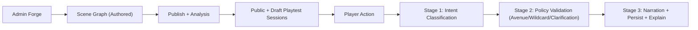
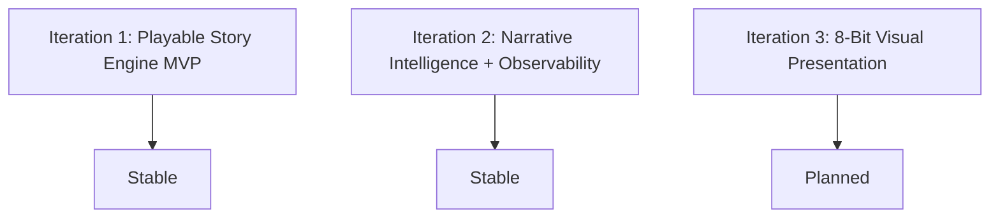

# LuminaQuest

Turn-based MERN story engine where authored branches stay deterministic and LLMs map free-form player intent to valid avenues.

## Project Overview

LuminaQuest is an intent resolution architecture where game authors create deterministic story graphs (scenes and avenues), while LLMs purely map player input to existing authored options. The system maintains server authority over all game state while providing flexible natural language interaction.

**Current Iteration:** Iteration 2 (Stable) - Narrative Intelligence & Observability

## Architecture Flow



## Iteration Status



### Iteration 2 Features
- Bounded wildcard policy (server-approved destinations only)
- Two-stage resolver + constrained narration pass
- Admin graph analysis + playtest launchers
- Player replay timeline + route explanation badge
- Resolver metrics/traces with optional Langfuse sink
- Three-path classification (avenue/wildcard/clarification)
- Playtest mode for admins to test from any scene

## Tech Stack

**Backend:**
- Express 5.2.1
- Mongoose 9.2.4
- JWT authentication
- bcryptjs 3.0.3
- OpenAI SDK 6.27.0 (for OpenRouter compatibility)
- Zod 4.3.6

**Frontend:**
- React 19.2.4
- Vite 7.3.1
- TanStack React Query 5.90.21
- Axios 1.13.6
- Zustand 5.0.11

**Infrastructure:**
- MongoDB 7 (Docker)
- Docker Compose

## Quick Start

### Prerequisites
- Node.js (v18 or higher)
- Docker and Docker Compose
- npm or yarn

### Setup Instructions

1. **Install dependencies:**
   ```bash
   npm install
   ```

2. **Configure environment variables:**
   ```bash
   cp .env.example .env
   ```

   Edit `.env` with your configuration:
   - `PORT` - Server port (default: 4000)
   - `MONGO_URI` - MongoDB connection string
   - `MONGO_CONNECT_RETRIES` - Connection retry attempts (default: 5)
   - `MONGO_CONNECT_RETRY_DELAY_MS` - Delay between retries (default: 2000)
   - `JWT_SECRET` - JWT signing secret
   - `CLIENT_ORIGIN` - CORS origin for web app (default: http://localhost:5173)
   - `OPENROUTER_API_KEY` - OpenRouter API key (optional - mock fallback when missing)
   - `OPENROUTER_MODEL` - Model identifier (default: meta-llama/llama-3.2-3b-instruct:free)
   - `OPENROUTER_SITE_URL` - Site URL for OpenRouter (default: http://localhost:5173)
   - `OPENROUTER_SITE_NAME` - Site name for OpenRouter (default: LuminaQuest)
   - `LANGFUSE_HOST` - Langfuse host (optional)
   - `LANGFUSE_PUBLIC_KEY` - Langfuse public key (optional)
   - `LANGFUSE_SECRET_KEY` - Langfuse secret key (optional)

3. **Start MongoDB:**
   ```bash
   npm run mongo:up
   ```

   View MongoDB logs:
   ```bash
   npm run mongo:logs
   ```

4. **Run development servers:**
   ```bash
   npm run dev
   ```

   This starts both:
   - Backend API on http://localhost:4000
   - Frontend web app on http://localhost:5173

   Or run individually:
   ```bash
   npm run dev:server  # Backend only
   npm run dev:web     # Frontend only
   ```

5. **Build for production:**
   ```bash
   npm run build
   npm run preview -w web
   ```

## Data Access Boundary

The web app **NEVER connects to MongoDB directly**. All persistence operations are server-side via API routes. This maintains security boundaries and enables future scaling.

- Frontend uses Axios API client with auth token injection
- All DB operations are backend-only via `server/src/models`, `server/src/routes`, and `server/src/services`
- Server validates all ObjectId references via Zod schemas

## Core Application Flow

1. **Admin Forge**: Admin users create game templates with scenes and avenues
2. **Publish Validation**: Games validated for graph reachability before publishing
3. **Player Journey**: Players start sessions and submit free-text actions
4. **LLM Intent Resolver**: Maps player input to authored avenue IDs via OpenRouter
5. **Session State**: Points, turns, and history tracked server-side

## API Endpoints

### Authentication
- `POST /api/auth/register` - User registration
- `POST /api/auth/login` - User login

### Admin Operations
- `POST /api/admin/games` - Create game template
- `PUT /api/admin/games/:gameId` - Update game template
- `POST /api/admin/games/:gameId/publish` - Publish game
- `POST /api/admin/games/:gameId/analyze` - Analyze game graph
- `POST /api/admin/games/:gameId/playtest` - Start playtest session
- `GET /api/admin/observability/resolver` - Get resolver metrics

### Player Operations
- `POST /api/sessions` - Start new session
- `POST /api/sessions/:sessionId/act` - Submit player action
- `GET /api/sessions/:sessionId/history` - Get session history

### Health Check
- `GET /health` - Health check with DB connection status

## Project Structure

This is an **npm workspaces** monorepo:

- **`server/`** - Express backend (port 4000)
  - `src/config/` - Environment and MongoDB connection with retry logic
  - `src/middleware/` - JWT authentication, role-based access control
  - `src/models/` - Mongoose models (GameTemplate, PlayerSession, User)
  - `src/routes/` - Express route handlers (auth, games, sessions)
  - `src/services/` - Business logic (LLM resolver, wildcard policy)
  - `src/utils/` - Game template validation (reachability, terminal scenes, graph integrity)

- **`web/`** - React + Vite frontend (port 5173)
  - `src/api.js` - Axios API client with auth token injection
  - `src/App.jsx` - Main application (Auth, Admin Forge, Player Journey panels)
  - Uses TanStack React Query for server state, localStorage for auth

- **`docs/`** - Project documentation and iteration tracking

## LLM Resolution Strategy

The `server/src/services/llmResolver.js` service uses OpenRouter with OpenAI-compatible Responses API:

- **Provider**: OpenRouter (base URL: `https://openrouter.ai/api/v1`)
- **Model**: Free routes preferred (`openrouter/free`) or explicit `:free` model slugs
- **Fallback**: Returns mock response in OpenAI Responses-like shape when API key missing or provider errors
- **Two-Stage Pipeline**:
  1. **Intent Classification**: Classify player intent into avenue/wildcard/clarification
  2. **Policy Validation**: Server validates returned `avenueId` exists in current scene before applying
  3. **Narration**: Generate contextual narration for the chosen path
- **Context**: Recent history provided to improve mapping accuracy
- **Observability**: Optional Langfuse integration for metrics and tracing

## Game Template Validation

Before publishing, game templates are validated for:
- Graph reachability (all scenes reachable from start)
- Terminal scenes exist (end points)
- Valid edges (avenue targets exist)

See `server/src/utils/validateGameTemplate.js` for implementation.

## Documentation

- [Iteration Checklist](docs/ITERATION_CHECKLIST.md)
- [Iteration 1 Summary](docs/ITERATION_1_SUMMARY.md)
- [Iteration 2 Execution](docs/ITERATION_2_EXECUTION.md)
- [Iteration 2 Summary](docs/ITERATION_2_SUMMARY.md)
- [CLAUDE.md](CLAUDE.md) - Development guidelines for Claude Code

## License

MIT
