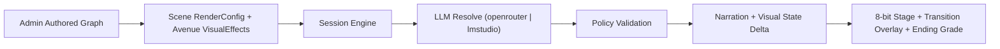
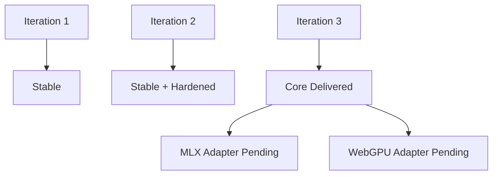

# LuminaQuest

Turn-based MERN story engine where authored branches stay deterministic and LLMs map free-form player intent to valid avenues.

## Architecture



## New UI Widgets
- Admin observability panel now shows:
  - token consumption (`input`, `output`, `total`)
  - compute/memory approximation (latency, CPU, RSS, heap)
- Player resolution badge now shows per-action:
  - token consumption
  - compute approximation

## Iteration Status



## Run Locally
1. `npm install`
2. `cp .env.example .env`
3. Set `JWT_SECRET` (24+ chars)
4. `npm run mongo:up`
5. `npm run dev`

## Auth + API Notes
- Auth is cookie-first (`httpOnly` cookie set on login/register, cleared on logout).
- Frontend API client uses `withCredentials: true`.
- Canonical action endpoint is `POST /api/sessions/action`.
- Every API response includes `x-request-id` for tracing failures.

## LLM Provider Switch
- `LLM_PROVIDER=openrouter`
- `LLM_PROVIDER=lmstudio`

## Docker (Lightweight, Multi-Arch)
```bash
# linux x64
docker buildx build --platform linux/amd64 -f server/Dockerfile -t luminaquest-server:amd64 .
docker buildx build --platform linux/amd64 -f web/Dockerfile -t luminaquest-web:amd64 .

# arm64 (Apple Silicon + Linux ARM)
docker buildx build --platform linux/arm64 -f server/Dockerfile -t luminaquest-server:arm64 .
docker buildx build --platform linux/arm64 -f web/Dockerfile -t luminaquest-web:arm64 .
```

## Docs
- [API Overview](/Users/aamirsyedaltaf/Documents/lumina-quest/docs/API.md)
- [UI Mockups](/Users/aamirsyedaltaf/Documents/lumina-quest/docs/UI_MOCKUPS.md)
- [Iteration Checklist](/Users/aamirsyedaltaf/Documents/lumina-quest/docs/ITERATION_CHECKLIST.md)
- [Iteration 3 Execution](/Users/aamirsyedaltaf/Documents/lumina-quest/docs/ITERATION_3_EXECUTION.md)
- [Iteration 3 Summary](/Users/aamirsyedaltaf/Documents/lumina-quest/docs/ITERATION_3_SUMMARY.md)
- [Admin Guide](/Users/aamirsyedaltaf/Documents/lumina-quest/for-admin.md)
- [User Guide](/Users/aamirsyedaltaf/Documents/lumina-quest/for-user.md)
