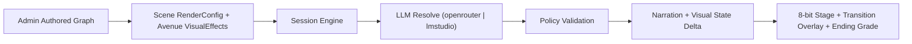
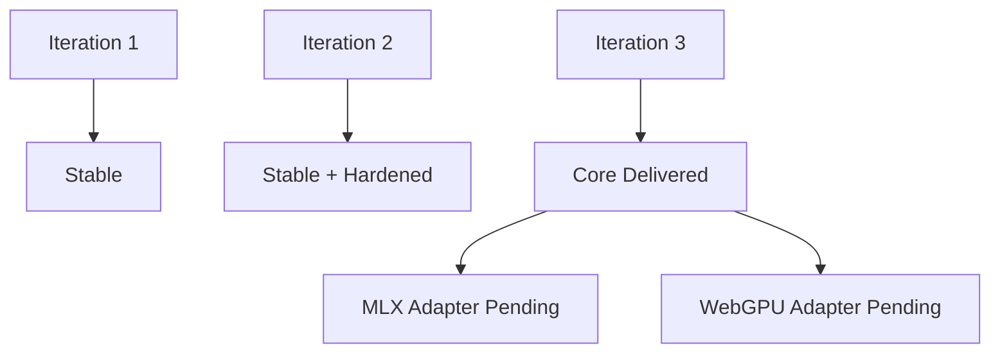

# LuminaQuest

Turn-based MERN story engine where authored branches stay deterministic and LLMs map free-form player intent to valid avenues.

## Architecture



## Iteration Status



## Run Locally

1. `npm install`
2. `cp .env.example .env`
3. Set `JWT_SECRET` (24+ chars)
4. `npm run mongo:up`
5. `npm run dev`

## LLM Provider Switch

Environment variable:
- `LLM_PROVIDER=openrouter` (external API)
- `LLM_PROVIDER=lmstudio` (on-device local API, OpenAI-compatible)

Provider config vars:
- OpenRouter: `OPENROUTER_*`
- LM Studio: `LMSTUDIO_BASE_URL`, `LMSTUDIO_API_KEY`, `LMSTUDIO_MODEL`

## Docker (Lightweight, Multi-Arch)

Server image build:
```bash
docker buildx build --platform linux/amd64 -f server/Dockerfile -t luminaquest-server:amd64 .
docker buildx build --platform linux/arm64 -f server/Dockerfile -t luminaquest-server:arm64 .
```

Web image build:
```bash
docker buildx build --platform linux/amd64 -f web/Dockerfile -t luminaquest-web:amd64 .
docker buildx build --platform linux/arm64 -f web/Dockerfile -t luminaquest-web:arm64 .
```

Single command multi-platform build (if pushing to a registry):
```bash
docker buildx build --platform linux/amd64,linux/arm64 -f server/Dockerfile -t <registry>/luminaquest-server:latest --push .
docker buildx build --platform linux/amd64,linux/arm64 -f web/Dockerfile -t <registry>/luminaquest-web:latest --push .
```

Note:
- In this sandbox, Docker daemon access may be unavailable; if so, run these commands on a host with Docker Engine running.

## Key Docs

- [Iteration Checklist](/Users/aamirsyedaltaf/Documents/lumina-quest/docs/ITERATION_CHECKLIST.md)
- [Iteration 3 Execution](/Users/aamirsyedaltaf/Documents/lumina-quest/docs/ITERATION_3_EXECUTION.md)
- [Iteration 3 Summary](/Users/aamirsyedaltaf/Documents/lumina-quest/docs/ITERATION_3_SUMMARY.md)
- [Hardening Checklist](/Users/aamirsyedaltaf/Documents/lumina-quest/docs/ITERATION_2_HARDENING.md)
- [API Overview](/Users/aamirsyedaltaf/Documents/lumina-quest/docs/API.md)
- [Admin Guide](/Users/aamirsyedaltaf/Documents/lumina-quest/for-admin.md)
- [User Guide](/Users/aamirsyedaltaf/Documents/lumina-quest/for-user.md)
