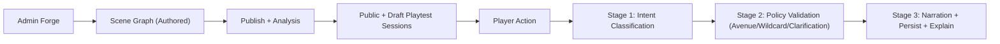
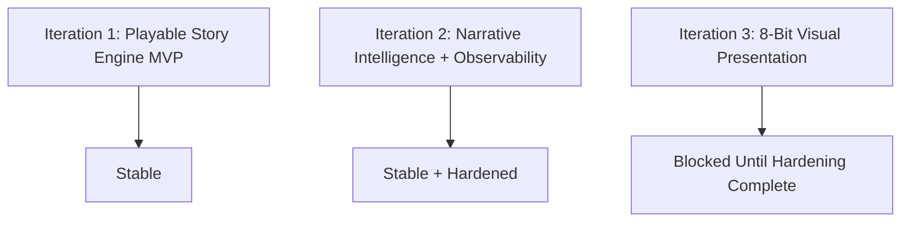
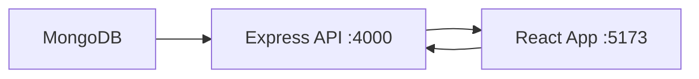

# LuminaQuest

Turn-based MERN story engine where authored branches stay deterministic and LLMs map free-form player intent to valid avenues.

## Project Context

## Iteration Status

## Hardening Gate

Iteration 3 should not begin until hardening checks are complete. Current status is complete:
- [Hardening Checklist](/Users/aamirsyedaltaf/Documents/lumina-quest/docs/ITERATION_2_HARDENING.md)

## Entrypoints

Setup:
1. Install dependencies: `npm install`
2. Configure env: copy `.env.example` to `.env`
3. Set `JWT_SECRET` to a strong 24+ char secret
4. Start MongoDB: `npm run mongo:up`
5. Run API: `npm run dev:server`
6. Run web app: `npm run dev:web`

## Security & Reliability Defaults

- Helmet security headers enabled
- Rate limiting enabled (`/api` and stricter `/api/auth`)
- Request payload sanitization and JSON body size limit enabled
- Standardized structured API errors
- Route async failures captured centrally
- Frontend error boundary + safe localStorage wrappers

## API Base Paths

- `/api`
- `/api/v1`

See API quick reference:
- [API Overview](/Users/aamirsyedaltaf/Documents/lumina-quest/docs/API.md)

## Data Access Rule

Frontend never connects directly to MongoDB. All persistence is backend-only.
