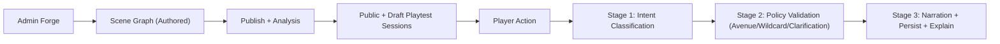
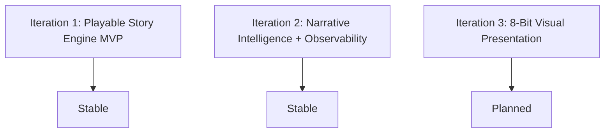
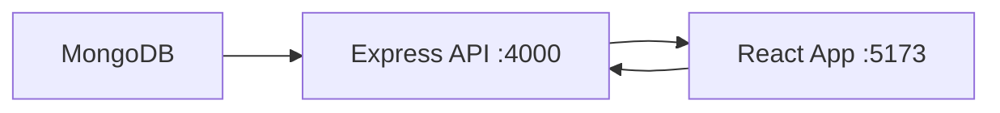

# LuminaQuest

Turn-based MERN story engine where authored branches stay deterministic and LLMs map free-form player intent to valid avenues.

## Project Context

## Iteration Status

- Iteration 2 highlights:
  - bounded wildcard policy (server-approved destinations only)
  - two-stage resolver + constrained narration pass
  - admin graph analysis + playtest launchers
  - player replay timeline + route explanation badge
  - resolver metrics/traces with optional Langfuse sink

## Entrypoints

Setup:
1. Install dependencies: `npm install`
2. Configure env: copy `.env.example` to `.env`
3. Start MongoDB: `npm run mongo:up`
4. Run API: `npm run dev:server`
5. Run web app: `npm run dev:web`

## Data Access Boundary

- Frontend never connects to MongoDB directly.
- All DB operations are backend-only via `server/src/models`, `server/src/routes`, and `server/src/services`.

## Iteration 2 API Additions

- `POST /api/admin/games/:gameId/analyze`
- `POST /api/admin/games/:gameId/playtest`
- `GET /api/admin/observability/resolver`
- `GET /api/sessions/:sessionId/history`
- `POST /api/sessions/:sessionId/act`

## Tracking Docs

- [Iteration Checklist](/Users/aamirsyedaltaf/Documents/lumina-quest/docs/ITERATION_CHECKLIST.md)
- [Iteration 2 Execution](/Users/aamirsyedaltaf/Documents/lumina-quest/docs/ITERATION_2_EXECUTION.md)
- [Iteration 2 Summary](/Users/aamirsyedaltaf/Documents/lumina-quest/docs/ITERATION_2_SUMMARY.md)
