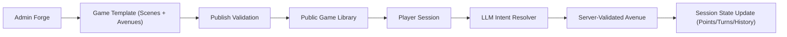
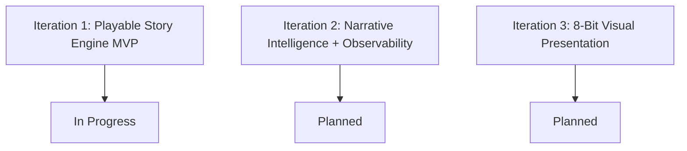
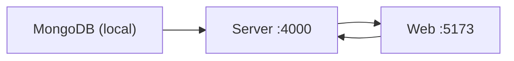

# LuminaQuest

Turn-based MERN story engine where authored branches stay deterministic and LLMs map free-form player intent to valid avenues.

## Project Context

## Iteration Status

- Iteration 1 delivered now:
  - Express + Mongo core APIs (auth, game CRUD/publish, session action engine)
  - Async OpenRouter resolver adapter with OpenAI Responses-style mock fallback
  - Minimal React UI for admin publish flow and player gameplay loop
- Iteration checklist: [`docs/ITERATION_CHECKLIST.md`](/Users/aamirsyedaltaf/Documents/lumina-quest/docs/ITERATION_CHECKLIST.md)

## Entrypoints

Setup:
1. Install dependencies: `npm install`
2. Configure env: copy `.env.example` to `.env`
3. Run API: `npm run dev:server`
4. Run web app: `npm run dev:web`

## OpenRouter Notes

The server uses OpenRouter via OpenAI-compatible SDK configuration:
- Base URL: `https://openrouter.ai/api/v1`
- Headers: `HTTP-Referer`, `X-Title`
- Model strategy: use free routes (`openrouter/free`) or explicit `:free` model slugs.

References:
- [OpenRouter API Overview](https://openrouter.ai/docs/api-reference/overview)
- [OpenRouter Quickstart](https://openrouter.ai/docs/quickstart)
- [OpenRouter Models (free examples)](https://openrouter.ai/models?q=free)
