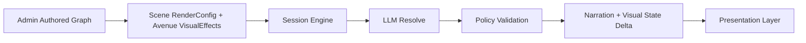

# LuminaQuest

Turn-based MERN story engine where authored branches stay deterministic and LLMs map free-form player intent to valid avenues.

## Architecture


```mermaid
flowchart LR
  A["Admin Authored Graph"] --> B["Scene RenderConfig + Avenue VisualEffects"]
  B --> C["Session Engine"]
  C --> D["LLM Resolve"]
  D --> E["Policy Validation"]
  E --> F["Narration + Visual State Delta"]
  F --> G["Presentation Layer"]
```

## Features
- **Authored Scene Graph**: Deterministic game branches with server-authoritative turn resolution
- **LLM Intent Mapping**: Free-form player input mapped to authored routes using configurable providers
- **Provider Switching**: Support for `openrouter`, `lmstudio`, with extensible adapter pattern
- **Visual State**: 8-bit styled presentation with layered components, transitions, and endings
- **Observability**: Token usage tracking, compute metrics, and request tracing
- **Security**: Cookie-first auth, optimistic concurrency, transaction wrapping, and structured errors

## Quick Start
1. `npm install`
2. `cp .env.example .env`
3. Set `JWT_SECRET` (24+ chars)
4. Optional CORS strictness:
   - `CLIENT_ORIGIN=http://localhost:5173`
   - `CORS_ALLOW_NO_ORIGIN=false`
5. `npm run mongo:up`
6. `npm run dev`

## Auth + API Notes
- Auth is cookie-first (`httpOnly` cookie set on login/register, cleared on logout).
- Frontend API client uses `withCredentials: true`.
- Canonical action endpoint is `POST /api/sessions/action`.
- Every API response includes `x-request-id` for tracing failures.
- Frontend API base URL is configurable via `VITE_API_BASE_URL`.

## LLM Provider Switch
- `LLM_PROVIDER=openrouter`
- `LLM_PROVIDER=lmstudio`

## Docker (Lightweight, Multi-Arch)
```bash
# linux x64
docker buildx build --platform linux/amd64 -f server/Dockerfile -t luminaquest-server:amd64 .
docker buildx build --platform linux/amd64 -f web/Dockerfile -t luminaquest-web:amd64 .

# arm64 (Apple Silicon + Linux ARM)
docker buildx build --platform linux/arm64 -f server/Dockerfile -t luminaquest-server:arm64 .
docker buildx build --platform linux/arm64 -f web/Dockerfile -t luminaquest-web:arm64 .
```

## Documentation
- [API Reference](docs/API.md) - Complete API contract and endpoint documentation
- [UI Mockups](docs/UI_MOCKUPS.md) - Visual design references
- [Development Guide](DEVELOPMENT.md) - Setup, architecture, and contribution guidelines
- [Changelog](CHANGELOG.md) - Project history and notable changes
- [Admin Guide](for-admin.md) - Administration and observability features
- [User Guide](for-user.md) - End-user documentation
