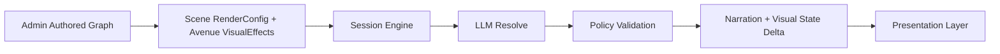

# LuminaQuest

Turn-based MERN story engine where authored branches stay deterministic and LLMs map free-form player intent to valid avenues.


## Architecture


```mermaid
flowchart LR
  A["Admin Authored Graph"] --> B["Scene RenderConfig + Avenue VisualEffects"]
  B --> C["Session Engine"]
  C --> D["LLM Resolve"]
  D --> E["Policy Validation"]
  E --> F["Narration + Visual State Delta"]
  F --> G["Presentation Layer"]
```

## Features

- **Authored Scene Graph**: Deterministic game branches with server-authoritative turn resolution
- **LLM Intent Mapping**: Free-form player input mapped to authored routes using configurable providers
- **Provider Switching**: Support for `openrouter`, `lmstudio`, with extensible adapter pattern
- **Visual State**: 8-bit styled presentation with layered components, transitions, and endings
- **Observability**: Token usage tracking, compute metrics, and request tracing
- **Security**: Cookie-first auth, optimistic concurrency, transaction wrapping, structured errors
- **Secrets Detection**: Pre-commit hooks using Gitleaks to prevent accidental commits of credentials
- **Docker Support**: Single-command startup with full stack containerization

## Quick Start

### Option 1: Docker Compose (Recommended)

```bash
# Start everything
docker compose up -d

# View logs
docker compose logs -f

# Stop everything
docker compose down
```

Access the application at **http://localhost:8080**

**Default Admin Credentials:**

- Username: `admin`
- Password: `admin`

### Option 2: Development Mode

```bash
# Install dependencies
npm install

# Start MongoDB (requires Docker)
docker compose up -d mongo

# Set up environment
cp .env.example .env
# Edit .env and set JWT_SECRET (24+ characters)

# Start server and web in separate terminals
npm run dev:server
npm run dev:web
```

Access the application at **http://localhost:5173`

## Configuration

### Required Environment Variables

```bash
# Server
PORT=4000
NODE_ENV=production

# Database
MONGO_URI=mongodb://mongo:27017/luminaquest

# Authentication
JWT_SECRET=your-secret-key-min-24-chars

# CORS
CLIENT_ORIGIN=http://localhost:8080
CORS_ALLOW_NO_ORIGIN=false
```

### LLM Provider Configuration

```bash
# LMStudio (Local Inference - Recommended for dev)
LLM_PROVIDER=lmstudio
LMSTUDIO_BASE_URL=http://127.0.0.1:1234/v1
LMSTUDIO_API_KEY=lm-studio
LMSTUDIO_MODEL=google/gemma-3-4b
```

```bash
# OpenRouter (External API - Good for production)
LLM_PROVIDER=openrouter
OPENROUTER_API_KEY=sk-or-v1-xxxxx
OPENROUTER_MODEL=openrouter/free
```

For Docker Compose, create a `.env` file in the project root:

```bash
# .env file for docker compose
JWT_SECRET=your-production-secret-key-min-24-chars
LLM_PROVIDER=lmstudio
LMSTUDIO_BASE_URL=http://host.docker.internal:1234/v1
LMSTUDIO_MODEL=google/gemma-3-4b
```

## Auth + API Notes

- Auth is cookie-first (`httpOnly` cookie set on login/register, cleared on logout).
- Frontend API client uses `withCredentials: true`.
- Canonical action endpoint is `POST /api/sessions/action`.
- Every API response includes `x-request-id` for tracing failures.
- Default admin user is automatically created on first startup.

## Development Setup

### Pre-commit Hooks (Required)

This project uses **Gitleaks** to prevent accidental commits of secrets, API keys, or credentials.

```bash
# Install pre-commit hooks (one-time setup)
pip install pre-commit
pre-commit install
```

The pre-commit hook will automatically scan for secrets before each commit. If it finds anything, it will block the commit and show you what needs to be fixed.

**Important:** Never bypass the pre-commit hook. If it blocks your commit, it means there's a security issue that needs to be addressed.

### Updating Gitleaks Baseline

If you need to update the baseline (rare, only when adding legitimate false-positives):

```bash
gitleaks detect --source . --baseline-path .secrets.baseline
```

### Security Best Practices

1. **Never hardcode secrets** in source code
2. **Always use environment variables** for sensitive data
3. **Never provide default values** for secrets in code (even fake ones that look real)
4. **Validate required environment variables** on startup
5. **Use `.gitignore`** to prevent committing `.env` files
6. **Rotate API keys immediately** if accidentally exposed

## Admin Guide

See [for-admin.md](./for-admin.md) for complete admin documentation including:

- Game creation and management
- LLM provider configuration
- Troubleshooting common issues

## Documentation

- [API Reference](docs/API.md) - Complete API contract and endpoint documentation
- [UI Mockups](docs/UI_MOCKUPS.md) - Mermaid diagrams of workflows and architecture

---

## Development

### Running Tests

```bash
# Backend tests
npm run test:server

# Backend smoke test
node server/smoke-test.js
```

## Docker Multi-Arch Builds

```bash
# Linux AMD64
docker buildx build --platform linux/amd64 -f server/Dockerfile -t luminaquest-server:amd64 .
docker buildx build --platform linux/amd64 -f web/Dockerfile -t luminaquest-web:amd64 .

# ARM64 (Apple Silicon)
docker buildx build --platform linux/arm64 -f server/Dockerfile -t luminaquest-server:arm64 .
docker buildx build --platform linux/arm64 -f web/Dockerfile -t luminaquest-web:arm64 .
```
