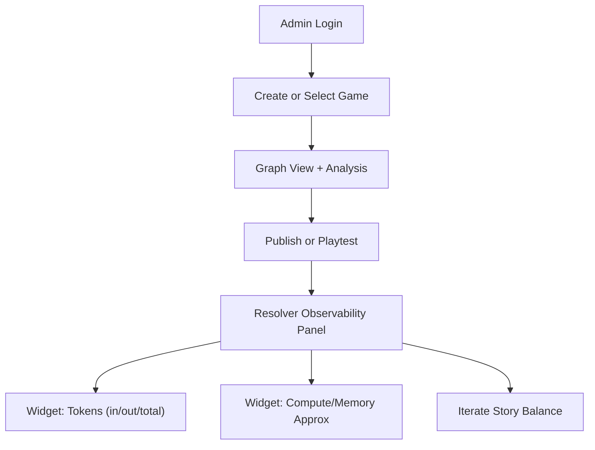
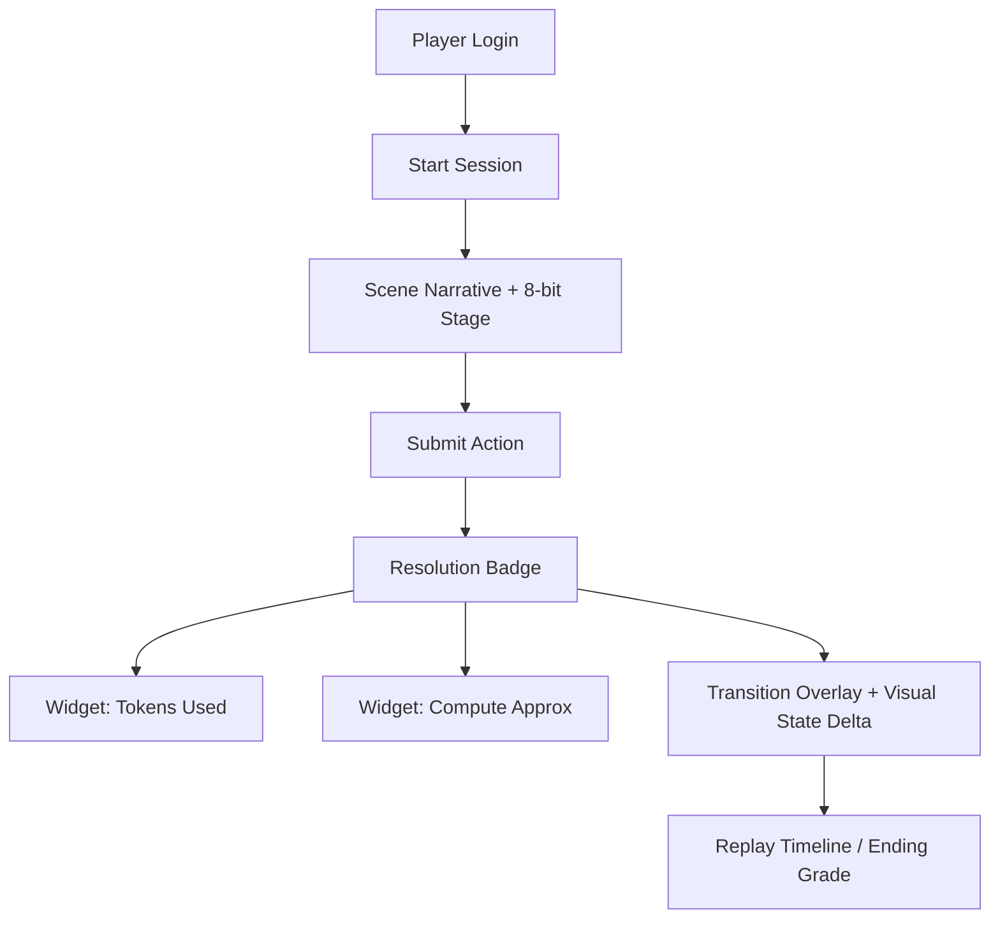
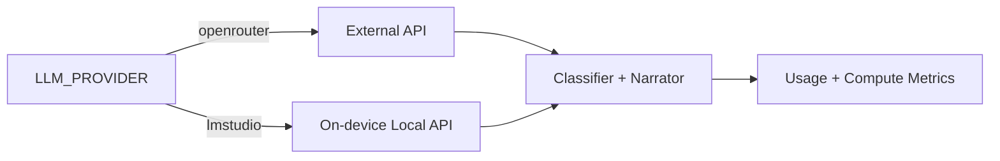

# UI Mockups (Mermaid)

## Admin Workflow Mockup

```mermaid
flowchart TD
  A["Admin Login"] --> B["Create or Select Game"]
  B --> C["Graph View + Analysis"]
  C --> D["Publish or Playtest"]
  D --> E["Resolver Observability Panel"]
  E --> E1["Widget: Tokens (in/out/total)"]
  E --> E2["Widget: Compute/Memory Approx"]
  E --> F["Iterate Story Balance"]
```

## Player Workflow Mockup

```mermaid
flowchart TD
  A["Player Login"] --> B["Start Session"]
  B --> C["Scene Narrative + 8-bit Stage"]
  C --> D["Submit Action"]
  D --> E["Resolution Badge"]
  E --> E1["Widget: Tokens Used"]
  E --> E2["Widget: Compute Approx"]
  E --> F["Transition Overlay + Visual State Delta"]
  F --> G["Replay Timeline / Ending Grade"]
```

## LLM Provider Switch Mockup

```mermaid
flowchart LR
  A["LLM_PROVIDER"] -->|"openrouter"| B["External API"]
  A -->|"lmstudio"| C["On-device Local API"]
  B --> D["Classifier + Narrator"]
  C --> D
  D --> E["Usage + Compute Metrics"]
```
