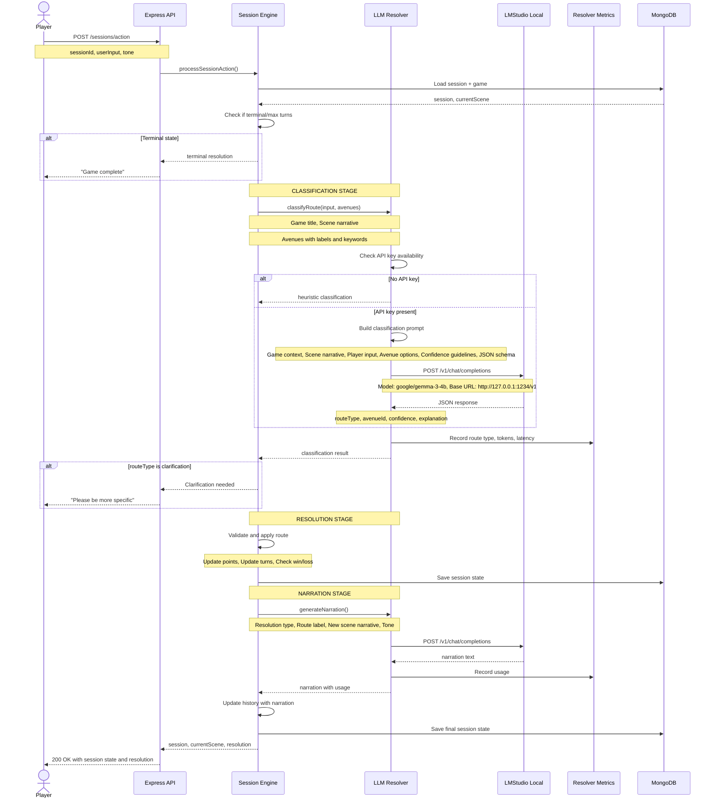
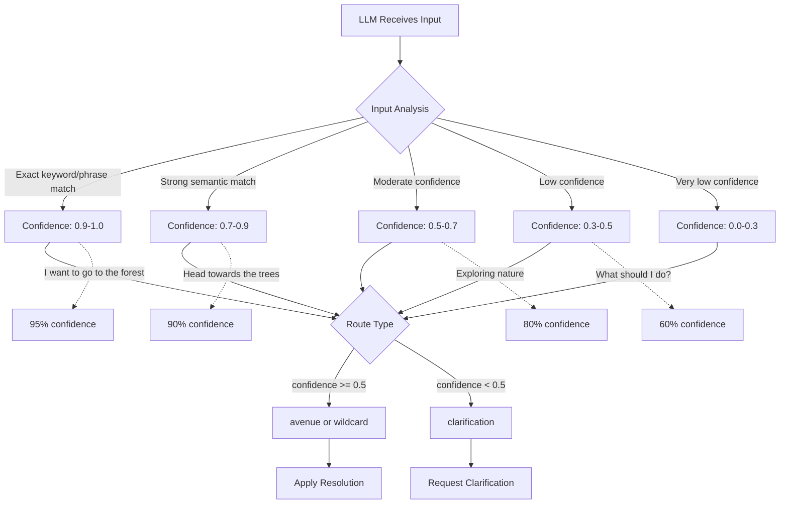
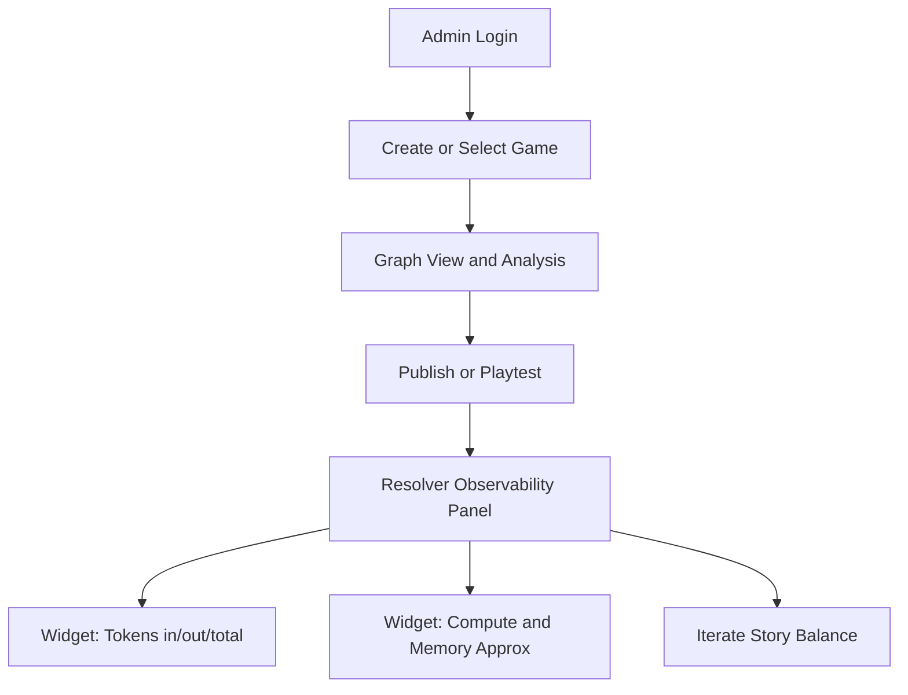
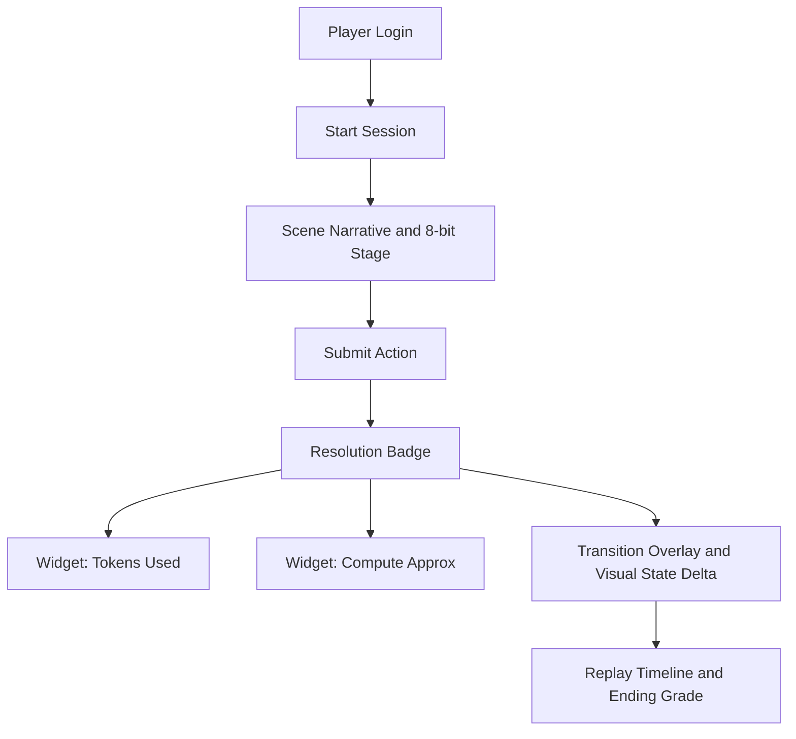
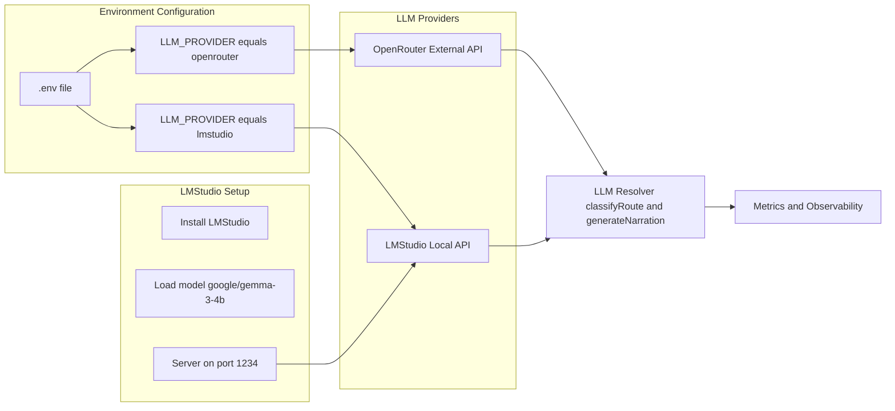
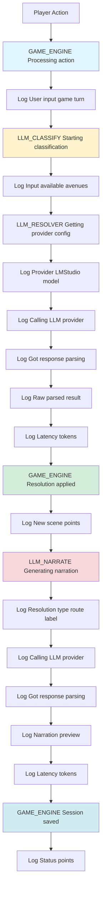
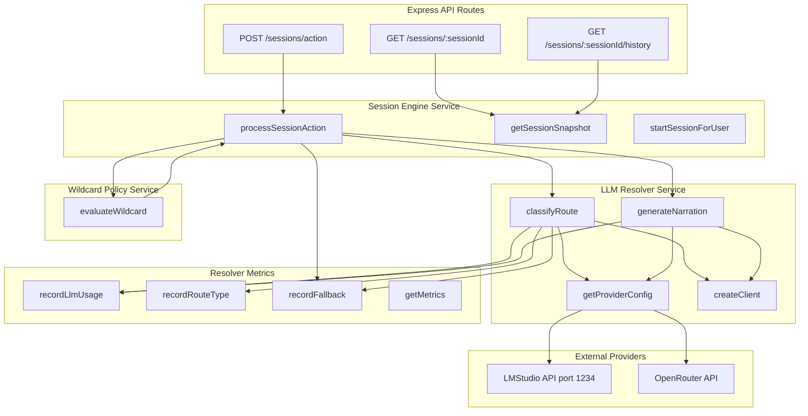

# UI Mockups (Mermaid)

## LLM Integration Workflow (Updated)

This diagram shows the complete flow of LLM-powered game actions, from user input to resolution:

## Confidence Calibration Flow

## Admin Workflow Mockup

## Player Workflow Mockup

## LLM Provider Configuration

## Debug Logging Flow

## Backend Service Architecture

